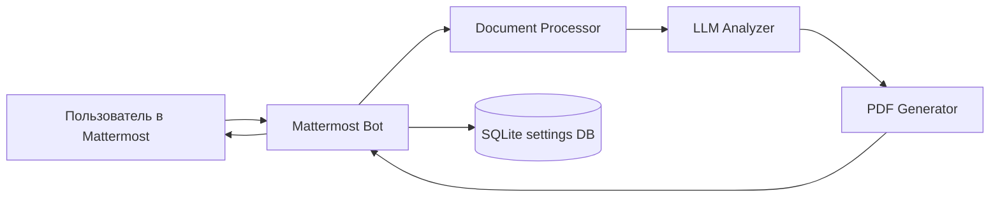
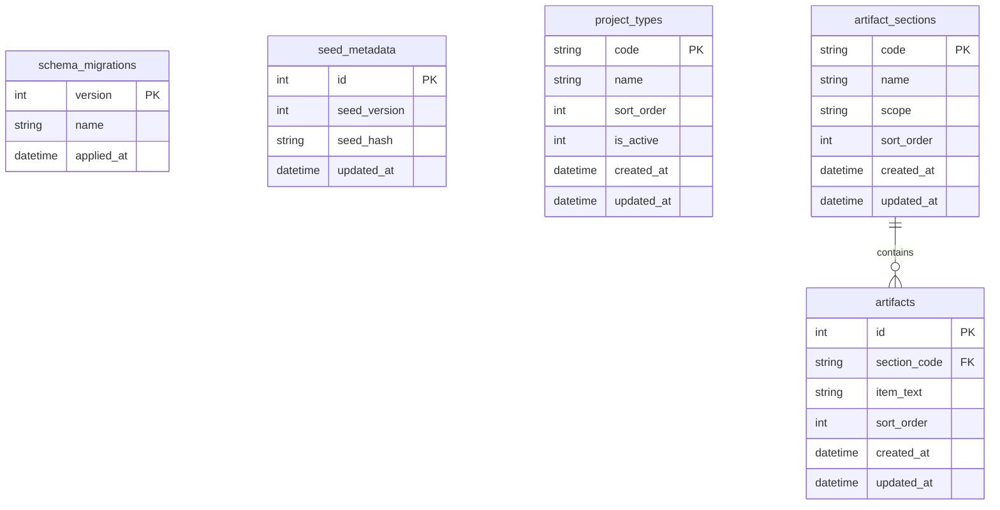
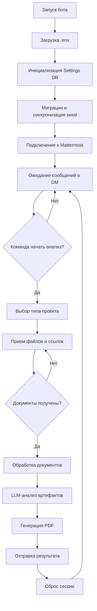

# Mattermost Document Analyzer Bot

[](https://github.com/chastnik/mm_bot)
[](https://www.python.org/)
[](LICENSE)
[](https://github.com/chastnik/mm_bot/actions/workflows/ci.yml)

Бот для анализа проектной документации в Mattermost: принимает файлы и ссылки на Confluence, извлекает текст, проверяет артефакты по типу проекта и отправляет PDF-отчет.

## Возможности

- Интерактивный сценарий в DM с ботом.
- Поддержка файлов: `PDF`, `DOCX`, `DOC`, `XLSX`, `RTF`, `TXT`.
- Анализ Confluence-страниц (включая дочерние страницы и вложения).
- Анализ артефактов через LLM endpoint с OpenAI-совместимым API.
- Генерация структурированного PDF-отчета.
- Хранение настроек проверки в SQLite с миграциями и seed-синхронизацией.

## Архитектура



### Схема БД настроек



## Требования

- Python `3.8+` (рекомендуется `3.11`).
- Доступ к Mattermost API.
- Доступ к Confluence (если используете ссылки).
- Доступ к LLM endpoint (OpenAI-compatible API).

## Быстрый старт (локально)

### 1) Клонирование

```bash
git clone https://github.com/chastnik/mm_bot.git
cd mm_bot
```

### 2) Виртуальное окружение

```bash
python3 -m venv venv
source venv/bin/activate
```

### 3) Установка зависимостей

```bash
pip install -r requirements.txt
```

### 4) Настройка `.env`

```bash
cp env.example .env
```

Заполните значения в `.env`:

- `MATTERMOST_URL`
- `MATTERMOST_TOKEN`
- `MATTERMOST_USERNAME`
- `MATTERMOST_PASSWORD`
- `MATTERMOST_TEAM`
- `MATTERMOST_SSL_VERIFY`
- `CONFLUENCE_USERNAME`
- `CONFLUENCE_PASSWORD`
- `CONFLUENCE_BASE_URL`
- `LLM_PROXY_TOKEN`
- `LLM_BASE_URL`
- `LLM_MODEL`
- `SETTINGS_DB_PATH` (опционально, по умолчанию `data/bot_settings.db`)

### 5) Проверка компонентов

```bash
python3 test_components.py
```

### 6) Запуск

```bash
python3 main.py
```

При старте бот автоматически:

- применяет миграции БД настроек;
- выполняет первичный seed, если БД пустая;
- сверяет `seed_version` и хеш `settings_seed.json` и при изменениях синхронизирует данные в БД.

## Docker

### Первичная установка и запуск

```bash
./install_prod_docker.sh
```

### Обновление существующей установки

```bash
./update_prod_docker.sh
```

### Полезные команды

```bash
docker compose ps
docker compose logs -f
docker compose restart
```

## Использование в чате

1. Отправьте `начать анализ` или `🚀 начать анализ`.
2. Выберите тип(ы) проекта: `BI`, `DWH`, `RPA`, `MDM`.
3. Отправьте документы:
   - прикрепленные файлы;
   - ссылки на Confluence.
4. По команде `🔄 начать анализ` бот запускает обработку.
5. Получите сообщение со сводкой и PDF-отчет.
6. Для нового цикла: `🚀 новый анализ`.

### Схема процесса



## Работа с настройками проверки

- Источник дефолтов: `settings_seed.json`.
- Хранилище runtime-настроек: SQLite (`SETTINGS_DB_PATH`).
- Инициализация вручную:

```bash
python3 init_settings_db.py
```

## Структура проекта

```text
mm_bot/
├── main.py
├── config.py
├── mattermost_bot.py
├── document_processor.py
├── llm_analyzer.py
├── pdf_generator.py
├── settings_db.py
├── settings_seed.json
├── init_settings_db.py
├── test_components.py
├── start_bot.sh
├── install_prod_docker.sh
├── update_prod_docker.sh
├── docker-compose.yml
├── Dockerfile
└── .github/workflows/ci.yml
```

## CI/CD

В CI выполняются:

- синтаксическая проверка Python и shell-скриптов;
- проверка инициализации БД настроек;
- smoke-проверка компонентов;
- сборка Docker-образа.

Dependabot настроен для:

- `pip`;
- `github-actions`;
- `devcontainers`.

## Устранение неполадок

### Проверка подключения к Mattermost

```bash
curl -I https://your-mattermost-server.com
curl -H "Authorization: Bearer your_token" https://your-mattermost-server.com/api/v4/users/me
```

### Проверка SSL

```bash
python3 check_ssl.py
```

### Проблемы с кириллицей в PDF

Установите шрифты DejaVu:

```bash
sudo apt-get install fonts-dejavu
```

## Логирование

- `bot.log` — основные события.
- `bot_output.log` — stdout/stderr при запуске через скрипты.
- Уровень логирования задается через `LOG_LEVEL`.

## Безопасность

- Храните токены и пароли только в `.env`.
- Не коммитьте `.env` и содержимое `data/`.
- Используйте `MATTERMOST_SSL_VERIFY=true` в production.
- Ограничьте права бота необходимыми каналами/операциями.

## Лицензия

MIT, подробности в `LICENSE`.
